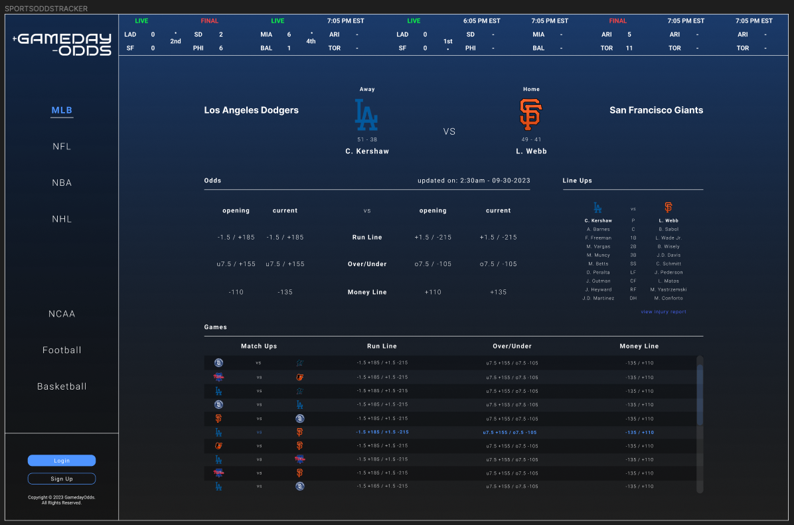

# SPORTS ODDS TRACKER

## GOAL:
This application tracks the sports-betting odds for U.S. SPORTS (see list below)
## TO RUN:
#### BACKEND
```
node server.js
```
#### CLIENT-SIDE
```
yarn start
```
#### PACKAGE.JSON
When accessing the client-side, the default yarn/npx run script contains version errors, so you will need to replace your start and build scripts with the following:
```
"start": "react-scripts --openssl-legacy-provider start",
"build": "react-scripts --openssl-legacy-provider build",
```
## API KEY ACCESS:
an api key is required to access data. When acquired, API Key can be stored in a .env file and imported into your server.js file. See link below to acquire API Key.
```
https://the-odds-api.com/#get-access
```
#### PRICING FOR USER
```
FREE/mo   500   requests/mo (no historical odds)
$25/mo    20k   requests/mo
$49/mo    90k   requests/mo
$99/mo    4.5m  requests/mo
$199/mo   12m   requests/mo
```
## URL & ENDPOINTS:
when fetching your api, you can insert these URLS to access the data. You have the option to access odds or scores, as well as specific sports. In development, you can access the backend data on port 9001, including any of the backend endpoints listed below. 'CONFIRMATION' is only used for successful access of your node server.
### BASE API
```
https://odds.p.rapidapi.com
```
### API ENDPOINTS
```
ODDS:

    /v4/sports/upcoming/odds

SCORES:

    /v4/sports/upcoming/scores

SPECIFIC SPORT:

    /v4/sports/{REPLACE-WITH-SPORT}/odds

SPORTS:

    americanfootball_nfl
    americanfootball_ncaaf
    baseball_mlb
    baseball_ncaa
    basketball_nba
    basketball_ncaab
    icehockey_nhl
    soccer_usa_mls
```
### BACKEND/ROUTING
```
LOCALHOST:9001/{insert-endpoint}

CONFIRMATION:

    /express_backend

ODDS:

    /api/odds

SCORES:

    /api/scores
```
